# Elec3300

This project builds an omni wheel car with a bluetooth remote controller. The omni wheel robot is based on STM32F103 with DRV8801 as motor driver. The controller is based on STM8S003.

## Car

### PCB Design

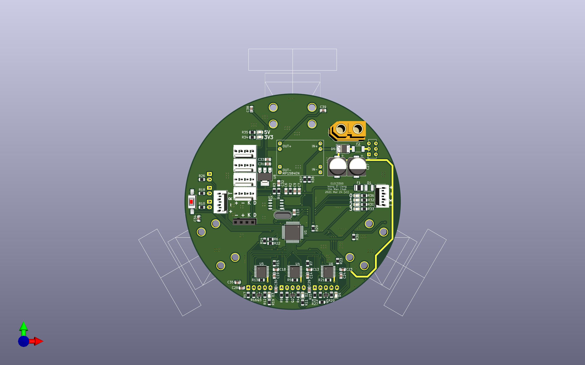
*Car PCB Top View*

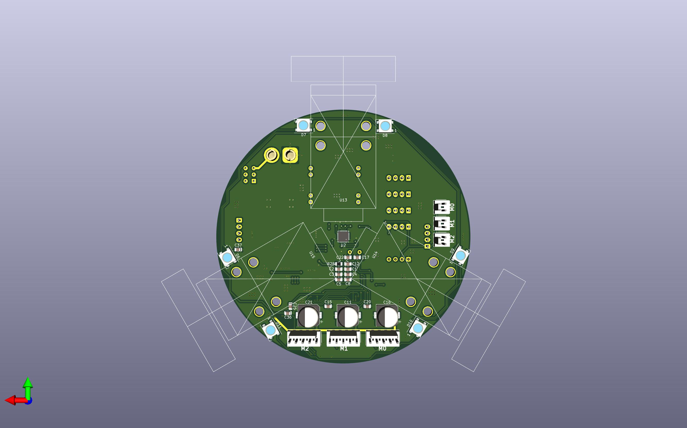
*Car PCB Bottom View*

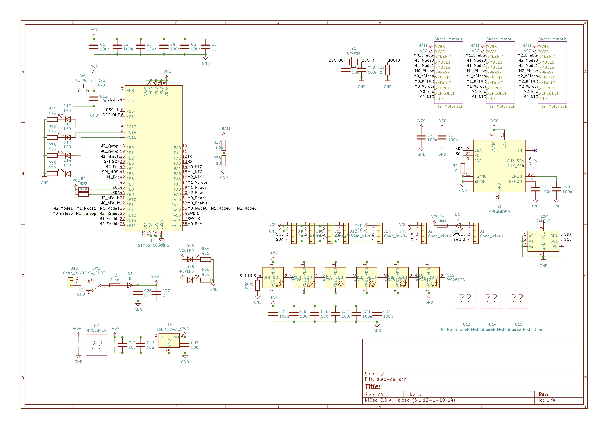
*see [schematic.pdf](car_hw/output/schematic.pdf)*

### 3D Print Components

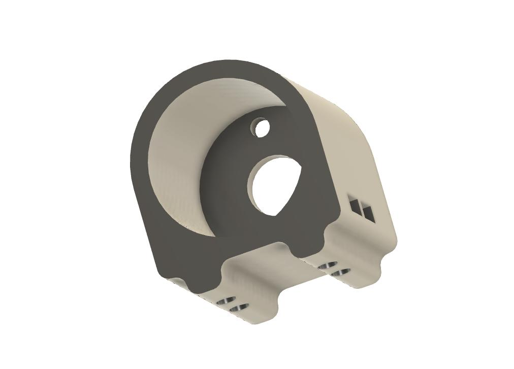
*Car Motor Mount*

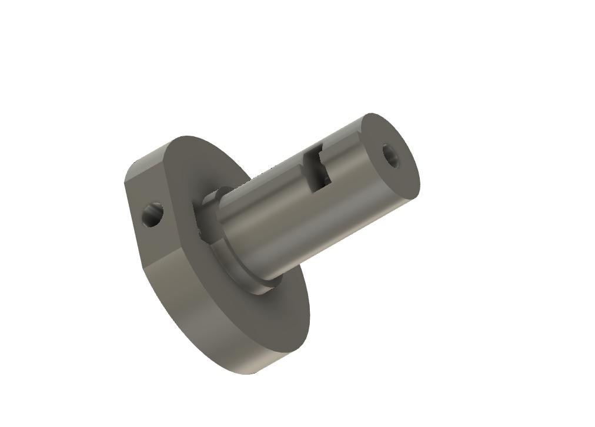
*Car Shaft A*

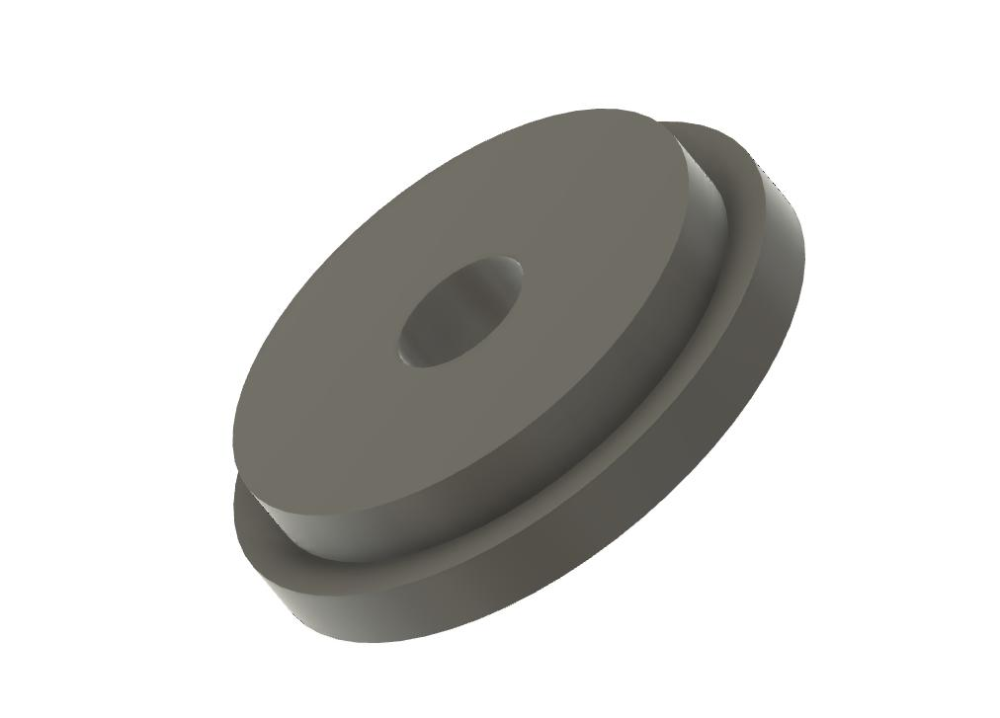
*Car Shaft B*

### Software

- Use STM32CubeIDE
- Refer to `/car_sw`

## Remote

### PCB Design

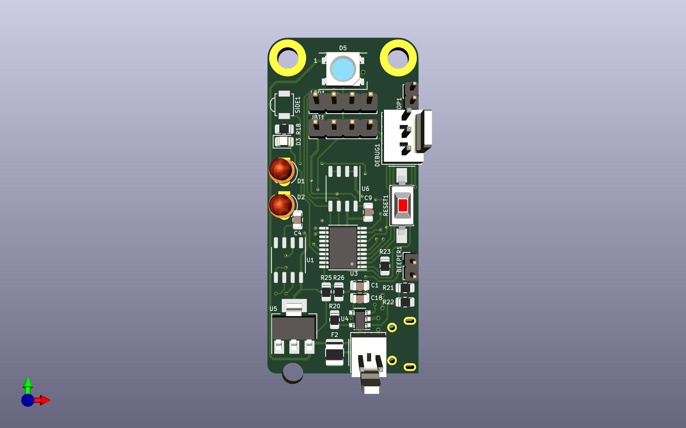
*Remote PCB Top View*

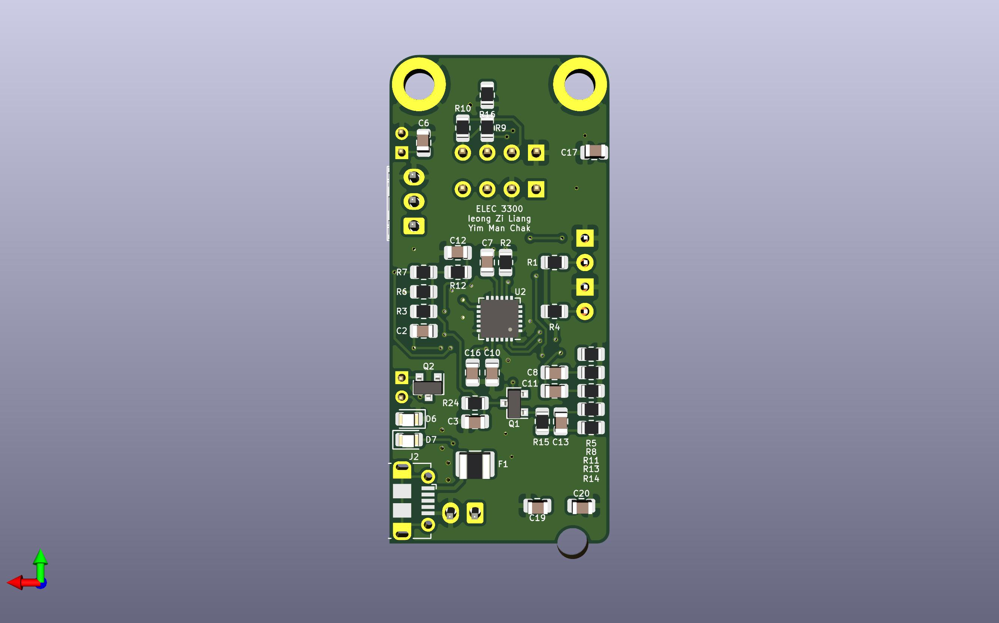
*Remote PCB Bottom View*

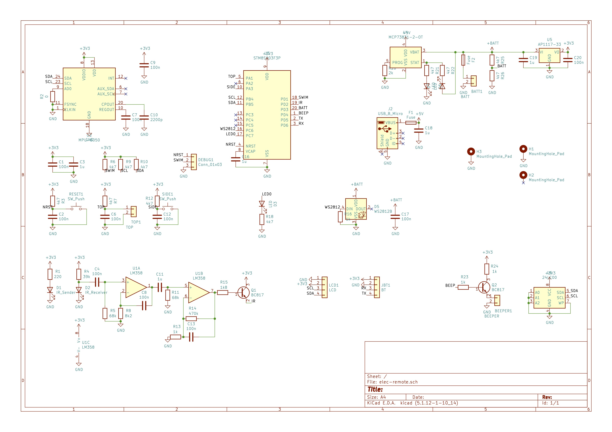
*see [schematic.pdf](remote_hw/output/schematic.pdf)*

### 3D Print Components

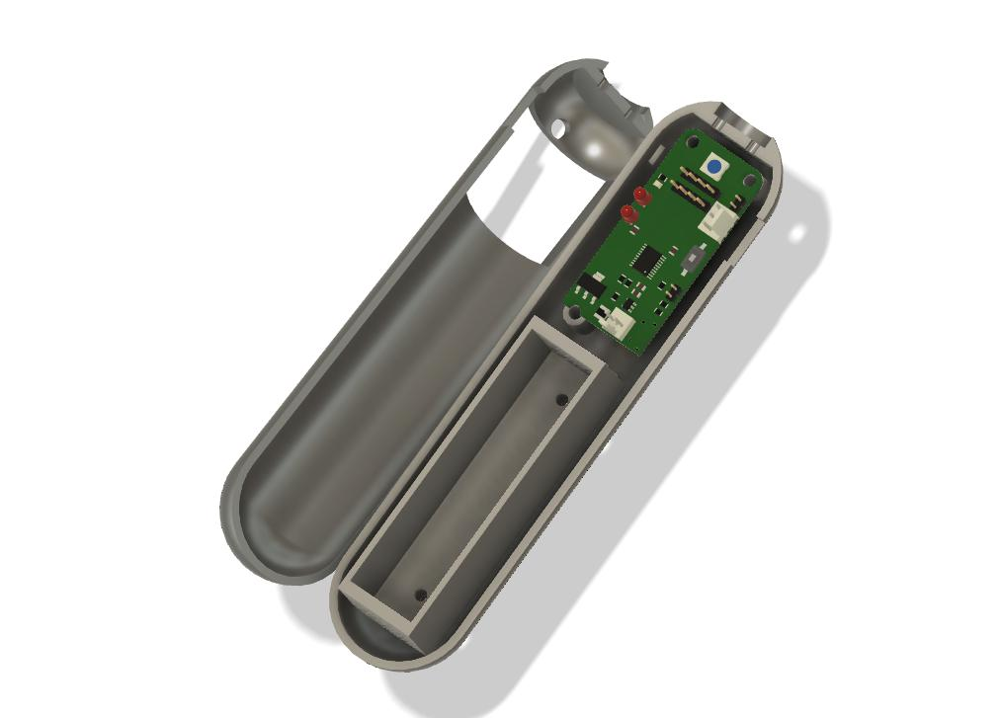
*Remote Case*

## Software

Setup:
1. `sudo apt-get install libusb-1.0-0-dev sdcc -y`
1. Get [stm8flash](https://github.com/vdudouyt/stm8flash)
1. Run `bash ./flash.sh` to compile and flash program

Reference: [Getting started with STM8 Development Tools on GNU/LINUX](https://www.codementor.io/@hbendali/)getting-started-with-stm8-development-tools-on-gnu-linux-zu59yo35x

Template: [stsw-stm8069](https://my.st.com/content/my_st_com/en/products/embedded-software/mcu-mpu-embedded-software/stm8-embedded-software/stsw-stm8069.html)

Library: [stm8s-sdcc](https://github.com/stecman/stm8s-sdcc)

## Final Deliverables
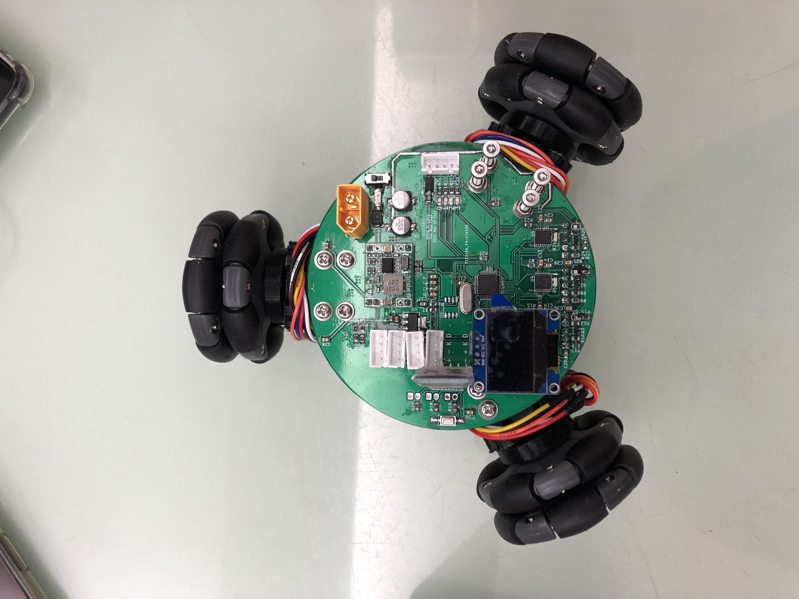
*Car Top*

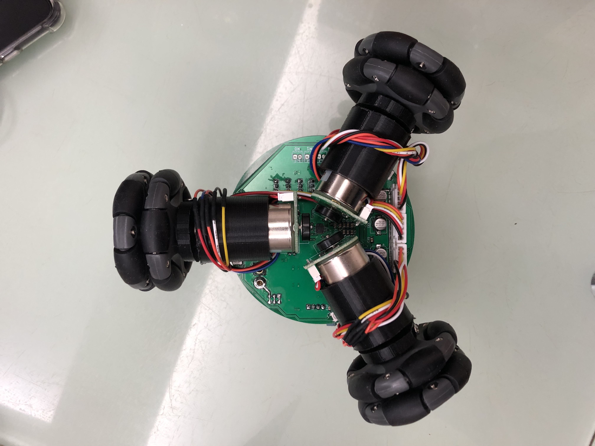
*Car Bottom*

*Remote Top*

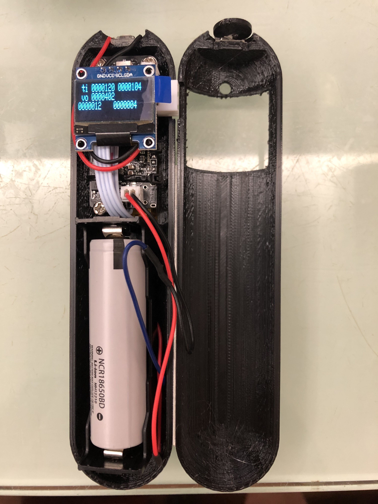
*Remote With Case*

## Progress
| urgency | difficulty | task | description | done? |
| --- | --- | --- | --- | --- |
| - | - | design pcb | | v |
| - | - | solder pcb | | v |
| - | - | mech design | | car(v), remote(v) |
| 0 | 0 | button | button | remote(v) | |
| 0 | 0 | led | led display | car(v), remote(v) |
| 1 | 1 | motor driver | (car) pwm & direction control | v |
| 1 | 2 | uart | communicate | car(v), remote(v) |
| 1 | 2 | i2c | communicate | car(v hardware), remote(v software) |
| 1 | 3 | mpu6050 (i2c) | port and simplify Adafruit version | car(v), remote(v) |
| 2 | 4 | ssd1306 lcd (i2c) | display line and text | car(v), remote(v) |
| 3 | 2 | ws2812b RGB led | display R/G/B | car(v), remote(x) |
| 4 | 1 | vibration motor | (remote) pwm output | x |
| 4 | 2 | 24c02 eeprom (i2c) | read and write data | x |
| 4 | ? | encoder | (car) encoder counter | v |
| 5 | 4 | gy530 TOF (i2c) | get distance | x |