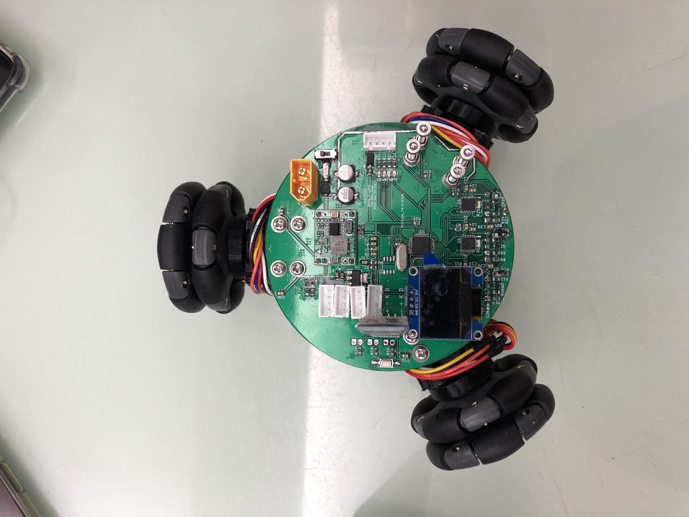
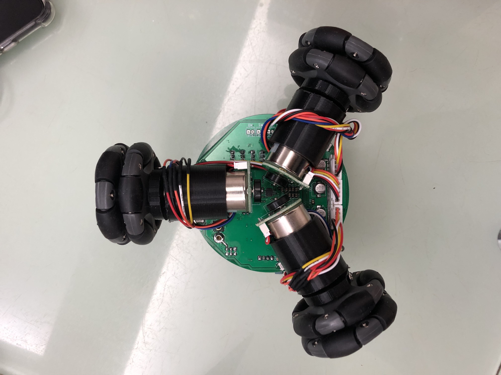
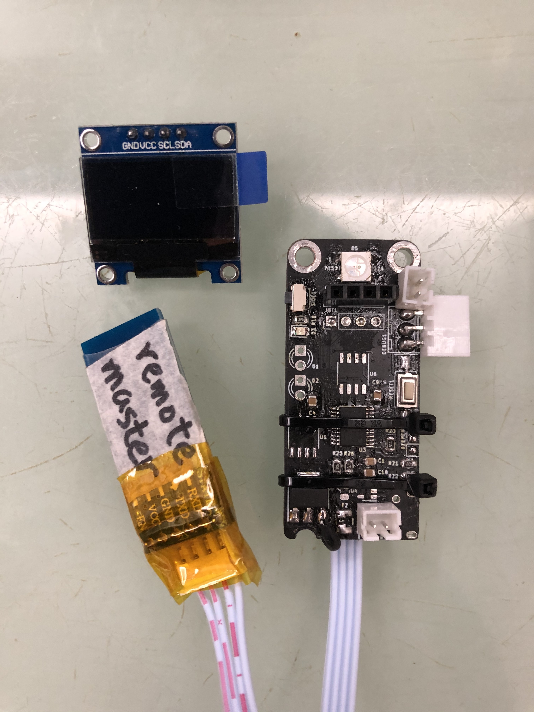
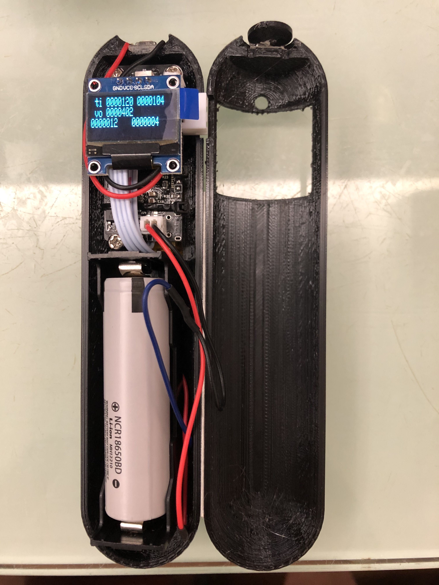

# elec3300

## progress
| urgency | difficulty | task | description | done? |
| --- | --- | --- | --- | --- |
| - | - | design pcb | | v |
| - | - | solder pcb | | v |
| - | - | mech design | | car(v), remote(v) |
| 0 | 0 | button | button | remote(v) | |
| 0 | 0 | led | led display | car(v), remote(v) |
| 1 | 1 | motor driver | (car) pwm & direction control | v |
| 1 | 2 | uart | communicate | car(v), remote(v) |
| 1 | 2 | i2c | communicate | car(v hardware), remote(v software) |
| 1 | 3 | mpu6050 (i2c) | port and simplify Adafruit version | car(v), remote(v) |
| 2 | 4 | ssd1306 lcd (i2c) | display line and text | car(v), remote(v) |
| 3 | 2 | ws2812b RGB led | display R/G/B | car(v), remote(x) |
| 4 | 1 | vibration motor | (remote) pwm output | x |
| 4 | 2 | 24c02 eeprom (i2c) | read and write data | x |
| 4 | ? | encoder | (car) encoder counter | v |
| 5 | 4 | gy530 TOF (i2c) | get distance | x |


## car_hw

- see [schematic.pdf](car_hw/output/schematic.pdf)

## car_sw

- use STM32CubeIDE

## car_mech

- see output/schematic.pdf

## remote_hw

- see [schematic.pdf](remote_hw/output/schematic.pdf)

## remote_sw

- Reference https://www.codementor.io/@hbendali/getting-started-with-stm8-development-tools-on-gnu-linux-zu59yo35x
- Template from https://my.st.com/content/my_st_com/en/products/embedded-software/mcu-mpu-embedded-software/stm8-embedded-software/stsw-stm8069.html
- Library from https://github.com/stecman/stm8s-sdcc
- stm8flash https://github.com/vdudouyt/stm8flash
1. git clone the repo
2. ```sudo apt-get install libusb-1.0-0-dev sdcc -y```
3. make && sudo make install
4. ```bash ./flash.sh``` for complilation and flash

## remote_mech

- see output/schematic.pdf

## images

*Car Top*


*Car Bottom*


*Remote Top*


*Remote With Case*
